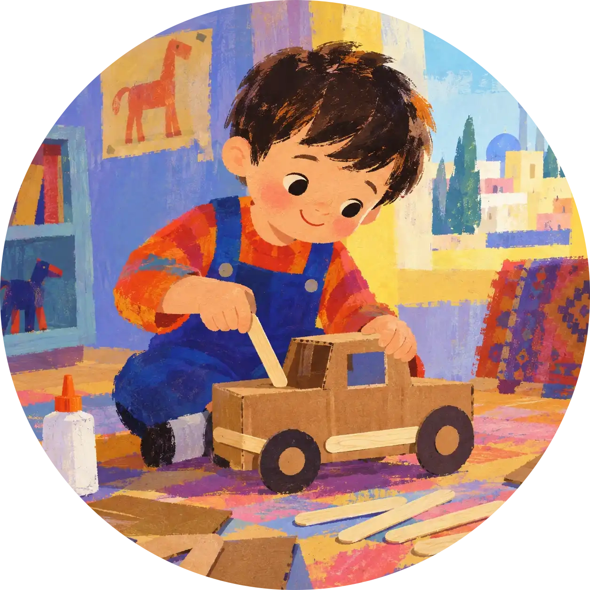

# دوره جامع هوش آرا — قالب صفحه اصلی

این پروژه یک قالب استاتیک، فارسی و RTL برای صفحه اول «دوره جامع هوش آرا» است.

## ساختار

- `index.html` — محتوای اصلی صفحه
- `css/styles.css` — تمام استایل‌ها و رنگ‌بندی
- `js/main.js` — منوی موبایل و آکاردئون سوالات متداول
- `assets/images/` — تصاویر سایت را اینجا قرار بدهید
- `assets/logo/` — لوگو و فایل‌های برند
- `assets/icons/` — آیکون‌های اختصاصی
- `design-reference/reference-page.png` — تصویر مرجع طراحی ارسالی

## جایگزین کردن تصاویر

در `index.html` هرجا `image-placeholder` می‌بینید، می‌توانید بعداً آن را با تگ `` جایگزین کنید.

نمونه:

```html

```

تصاویر پیشنهادی:
- `assets/images/hero-character.webp`
- `assets/images/course-intro-poster.webp`
- `assets/images/representative.webp`

## فونت

قالب از Vazirmatn استفاده می‌کند و در صورت اتصال به اینترنت فونت از Google Fonts بارگذاری می‌شود. اگر نسخه آفلاین فونت را اضافه کردید، می‌توانید `@font-face` را در ابتدای `css/styles.css` قرار دهید.

## رنگ‌های اصلی

- Pink: `#F7DFE5`
- Soft Pink: `#FCEFF2`
- Gold: `#D8A13B`
- Cream: `#F8EFE5`
- Green: `#8EA294`
- Ink: `#302934`

## اجرا

فایل `index.html` را با مرورگر باز کنید. برای توسعه حرفه‌ای‌تر می‌توانید پروژه را بعداً به Vite/React یا هر بک‌اند دلخواه منتقل کنید.
